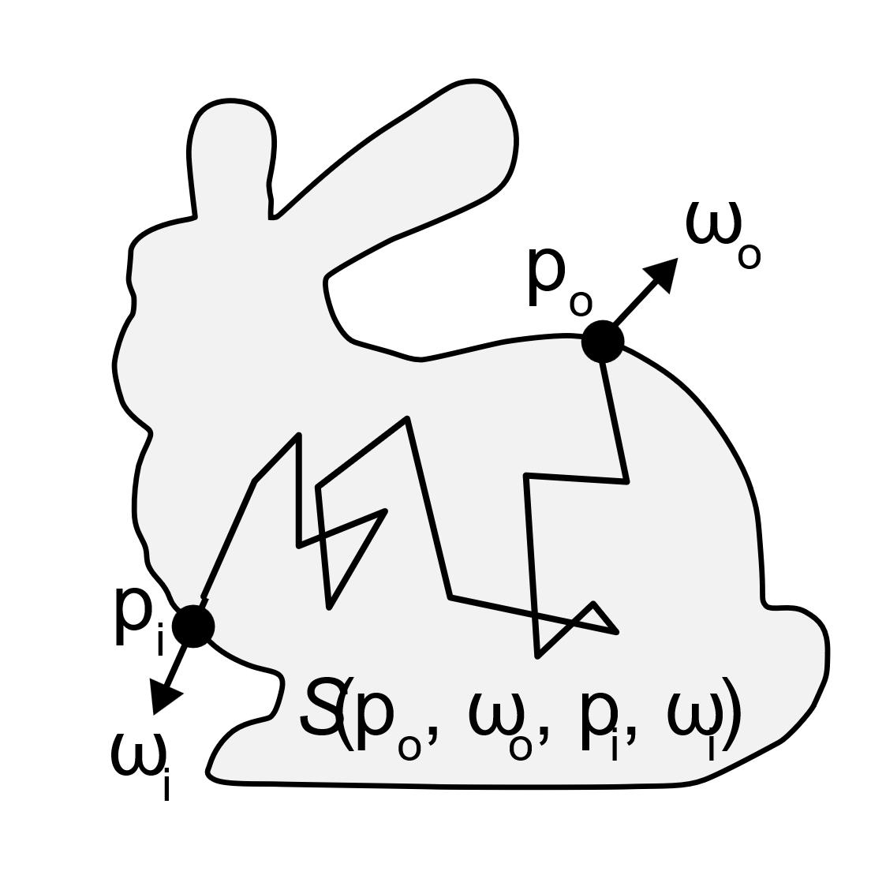
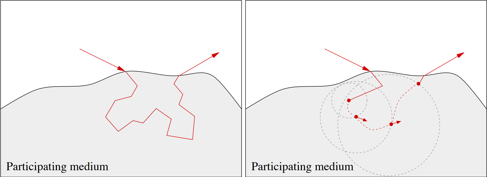
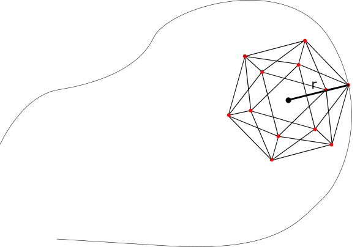

# Physically-based Rendering: Shell Tracing in Homogeneous Mediums

A widely accepted method for computing sub-surface scattering is through MonteCarlo Path Tracing, where the ray once enters in a medium, is scattered inside in a random fashion before it exits from a different point on the surface of the medium. The downside of this approach is the rays might take alot of ray traversals inside the medium to produce decent results, especially for the mediums that has high albedo and emmission coefficients.

The alternative to this is to approximate the path within the medium where the steps are computed based on a probability distribution function generated with the given phase function.

## Instructions on how to build

### On Linux

- Create a `build` folder in the working directory
- cd to `build` folder and run `cmake ..`, make sure that the gcc compiler is installed
- Build the project using `make -j <num-threads>`, run the executable `./pbrt`

### On Windows

- Create a `build` folder in the working directory
- Use cmake compiler using the appropriate version of visual studio
- open `.sln` file and run the project

## Project Overview

- Utilize existing PBRT implementation for path tracer to perform Shell Tracing
- Preprocess to generate PDF for position and direction of the ray exiting a sphere
- Generate a list of sphere with varying radiuses
- Compute minimum distance from the boundaries of the medium for a given point
Select the appropriate pdf for the given radius
- Compute exit position and direction using cascading set of 1D CDFs
- Update the position and direction and reiterate through the loop

## Methodologies

### Precompute

- A naïve approach to pdf is to have 9D function representing each elements
- This breakdowns to incoming pos (3D) & dir (2D), outgoing pos (2D) & dir (2D)
- The memory requirement needs to be kept in check
- Need for reducing dimensionality without loosing generality
- Achieved by moving the point to center and selecting direction pointing upwards
- The outgoing position and direction is computed

### Precompute (contd.)

- For dimensionality reduction, the φ angle for the outgoing position is randomly sampled from 2π
- The starting direction and positions are fixed
- The problem is reduced to a 3D pdf
- For given radius sizes, the path is traced inside the sphere from the starting point and bins are populated
- The α and θ angles are discretized by sampling uniformly from -1 to 1 and computing arctan to get the angle

### Min Distance from Mesh Boundary

- In order to compute for the right radius size, closest boundary from the mesh is computed
- For approximation, a normalized icosahedron is used to sample directions around the point
- The nearest distance from the projected directions is stored for retrieving pdf

### Sampling PDF

- While rendering, the pdf is sampled by constructing CDFs and 1D inverse method
- For α, the CDF is constructed by summing up all the dims and fixing the α dim – generates a 1D array
- The 1D array for α is sampled using 1D inverse method
- The selected bin’s index and value is stored
- For the fixed value of α, now the CDF and correspondingly 1D inverse is computed for θ
- The same process is repeated for φ, given fixed values of α and θ

### Ray Transformation

- Recall assumption taken at the start for dimensionality reduction
- For a given direction, the target position and direction needs to be adjusted
- Achieved by transformation matrix generated from current position and direction
- Transformation applied to the outgoing position and direction generated from shell tracing

## Results

<table width=100% style="align:center;text-align:center">
<tr>
<td></td>
<td></td>
</tr>
<tr>
<td>Higher Absorbtion Coefficient</td>
<td>Lower Absorbtion Coefficient</td>
</tr>
</table>

### Comparison - Path Tracing

<table width=100% style="align:center;text-align:center">
<tr>
<td></td>
<td></td>
</tr>
<tr>
<td>Shell Traced: High Scattering</td>
<td>Path Tracing: High Scattering</td>
</tr>
</table>